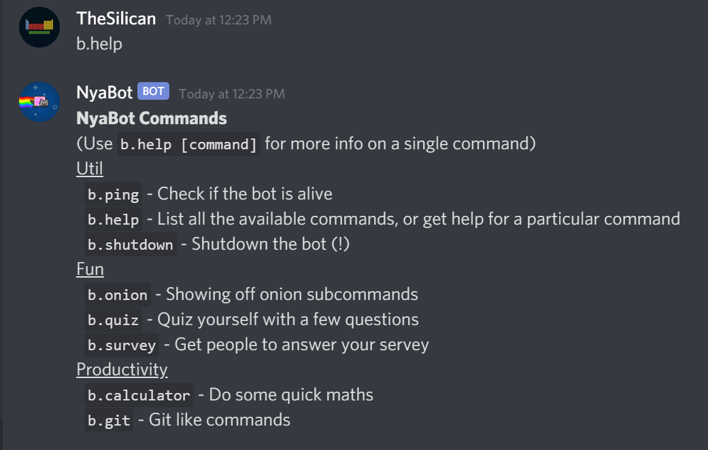
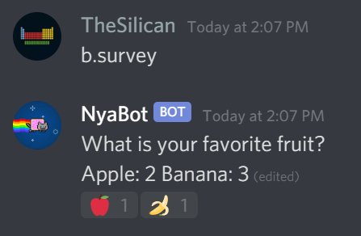

# Getting Started

- [Getting Started](#getting-started)
  - [Before starting...](#before-starting)
  - [How it works](#how-it-works)
  - [Creating a bot](#creating-a-bot)
  - [Creating Command Groups](#creating-command-groups)
  - [Creating Commands](#creating-commands)
  - [Command Arguments](#command-arguments)
    - [Argument Validators](#argument-validators)
  - [Subcommands](#subcommands)
  - [The `CommandMessage`](#the-commandmessage)
    - [Reaction Menu](#reaction-menu)

## Before starting...

Ensure that you are using Node.js version `>=14`. Install with:

```
$ npm install its-not-commando
```

You will also have to install `discord.js` version 12 as a peer dependency. Install with:

```
$ npm install discord.js@12
```

This guide assumes you are comfortable working in javascript/typescript. This guide also assumes you
know the basics of discord.js. If not, first try [creating a simple discord.js bot][discordjsguide] first, without `its-not-commando`.

This project works best with **[Typescript][typescript]**, a typed super-set of javascript. All examples will be given in Typescript. But it works just as well using javascript.

**If you are using typescript**, you must ensure that you have
`"target": "es2017"` (or higher) in your `tsconfig.json`. This project requires
ES6 features, specifically ES6 classes. It also requires `async` and `await`, which are available in es2017.

## How it works

`its-not-commando` works with the concepts of _commands_. Discord users can run commands by entering the prefix of the bot, followed by the name of the command. For example, the following is the built-in `help` command:


Commands can contain arguments like numbers, strings, etc. Commands can also contain sub-commands, each of which behave just like normal commands.

All commands belong to a command group. (You can see the three types of commmands in the above image). Command groups can be created, or you can just use the `default` command group

## Creating a bot

To get started, you should first create an instance of the `Client` client. A `Client` is the running instance of your discord bot. The
`Client` class actually extends [discord.js Client][discordjsclient], so you can use all the methods from a discord.js `Client`.

You must initialize the client with your discord bot token, a prefix used by the bot, and your discord user ID.

```typescript
import { Client } from "its-not-commando";

const client = new Client({
  owner: "YOUR_DISCORD_USER_ID",
  prefix: "+",
  token: "YOUR_DISCORD_BOT_TOKEN",
});

client.start();
```

## Creating Command Groups

Commands are grouped into "command groups".

By default, there are two built-in command groups. The `default` command group contains all commands that don't specify a command group. The `util` group is used by the built-in commands `Help`, `Ping`, and `Shutdown`.

Add additional command groups to the client using `client.registry.registerGroup()`. You can optionally register multiple command groups using `client.registry.registerGroups()`

```typescript
client.registry.registerGroup({
  name: "fun",
  description: "Fun commands to try",
});

client.registry.registerGroup({
  name: "money",
  description: "Commands related to money",
});

// Or
client.registry.registerGroup([
  {
    name: "fun",
    description: "Fun commands to try",
  },
  {
    name: "money",
    description: "Commands related to money",
  },
]);
```

## Creating Commands

A command is an ES6 `class` that inherits from the `Command` or `SubCommand` classes.

Here is an example of a command that responds with "Hello World!".

```typescript
import { Command, Client, CommandMessage } from "its-not-commando";

class HelloWorldCommand extends Command {
  constructor() {
    super({
      name: "hello",
      aliases: ["h"],
      group: "fun",
      description: "Say hello",
    });
  }

  async run(msg: CommandMessage, args: string[], client: Client) {
    msg.say("Hello World!");
  }
}
```

Then, you can register the command with the client using `client.registry.registerCommand()`.

```typescript
client.registry.registerCommand(SayHelloCommand);
```

Here's a full working example

```typescript
import { Command, Client, CommandMessage } from "its-not-commando";

class HelloWorldCommand extends Command {
  constructor() {
    super({
      name: "hello",
      aliases: ["h"],
      group: "fun",
      description: "Say hello",
    });
  }

  async run(msg: CommandMessage, args: string[], client: Client) {
    msg.say("Hello World!");
  }
}

const client = new Client({
  owner: "YOUR_DISCORD_USER_ID",
  prefix: "+",
  token: "YOUR_DISCORD_BOT_TOKEN",
});

client.registry.registerCommandGroup({
  name: "fun",
  description: "Fun commands to try",
});

client.registry.registerCommand(HelloWorldCommand);

client.start();
```

You can then run your command in discord by typing
`+hello` or `+h` (using alias).

By default, the `Help`, `Ping`, and `Shutdown` commands are already included.

Here are the options available when constructing a command:

| Command Option | Description                                                                                          | Example                                                                           |
| -------------- | ---------------------------------------------------------------------------------------------------- | --------------------------------------------------------------------------------- |
| name           | The name used to execute the command                                                                 | `"npm"`                                                                           |
| description    | A brief description of the command, shown to the user in the `help` command                          | `"Manages your packages"`                                                         |
| aliases        | An array of command aliases, which can be substituted for the actual command                         | `["n", "nodepackagemanager"]`                                                     |
| arguments      | An array of command arguments                                                                        | (See [command arguments](#command-arguments))                                     |
| subcommands    | An array of subcommand classes. If subcommands are provided, command arguments are ignored           | `[InstallCommand, UpdateCommand]`                                                 |
| details        | A more extensive description of the command, shown to the user when running `help command`           | `"This command manages your node packages [...]"`                                 |
| examples       | An array of example command usages (tuple of command usage and explanation)                          | `[["npm install", "installs packages"], ["npm update", "updates your packages"]]` |
| rateLimit      | Options for rate limiting. `max` command usages can be used within a window of `seconds` seconds     | `{max: 10, seconds: 60}`                                                          |
| group          | The name of the command group that this command belongs to. Default group is "default"               | `"fun"`                                                                           |
| ownerOnly      | Whether this command is only allowed by the bot owner. Default is false                              | `true`                                                                            |
| dmAllowed      | Whether or not this command is allowed in DMs. Default is true                                       | `false`                                                                           |
| hidden         | Whether or not this command is hidden from listing when running the `help` command. Default is false | `true`                                                                            |

## Command Arguments

Command arguments are an array of strings passed to the Command, similar to command arguments in command-line applications. They are accessible via the `args[]` parameter of `Command.run()`

For example, in the command `"+math 1 plus 2"`, the arguments would be `"1"`, `"plus"`, and `"1"`

You can add command arguments to your commands with the `arguments` option. You can add validators to arguments using [Validators](#argument-validators)

```typescript
import { Command, CommandMessage, Client, Validator } from "its-not-commando";

class IsThirteenCommand extends Command {
  constructor() {
    super({
      name: "isthirteen",
      aliases: ["is13"],
      group: "fun",
      description: "Check if a number is 13",
      arguments: [
        {
          name: "number",
          validator: Validator.Integer,
        },
      ],
    });
  }

  async run(msg: CommandMessage, args: string[], client: Client) {
    const num = parseInt(args[0], 10);
    if (num === 13) {
      msg.say("Yay, your number is 13");
    } else {
      msg.say("Nope your number is not 13");
    }
  }
}
```

Using the command in Discord:

- `+isthirteen 13` (`Yay, your number is 13`)
- `+is13 13` (`Yay, your number is 13`)
- `+isthirteen 17` (`Nope your number is not 13`)
- `+isthirteen Kevin` (`Incorrect command usage. The proper usage is ...`)

You can have multiple command arguments, some of which are optional. Optional arguments must come after non-optional arguments.

```typescript
import { Command, CommandMessage, Client, Validator } from "its-not-commando";

class IsThirteenCommand extends Command {
  constructor() {
    super({
      name: "isthirteen",
      aliases: ["is13"],
      group: "fun",
      description: "Check if a number is 13",
      arguments: [
        {
          name: "number",
          validator: Validator.Integer,
        },
        {
          name: "fuzzy",
          validator: Validator.OneOf(["yes", "no"]),
          optional: true,
          defaultValue: "no",
        },
      ],
    });
  }

  async run(msg: CommandMessage, args: string[], client: Client) {
    const num = parseInt(args[0], 10);
    const fuzzy = args[1];
    if (num === 13) {
      msg.say("Yay, your number is 13");
    } else {
      if (fuzzy === "yes" && 11 < num && 15 > num) {
        msg.say("Yay, your number is 13");
      }
      msg.say("Nope your number is not 13");
    }
  }
}
```

All Argument Options:
| Argument Option | Description |
| --------------- | ------------------------------------------------------------------------------------------------------------------------------------------------------ |
| name | The name of the argument |
| validator | An optional validator. See below for validator types. Defaults to `Validator.String` |
| optional | Whether or not the argument is optional. Defaults to false |
| defaultValue | The default value of the argument. Only used if optional is true |
| multi | If multi is true, this argument will combine any remaining arguments into one big string. Can only be set for the last argument. Defaults to false |

### Argument Validators

You can use the following validators to validate your arguments. Invalid arguments in a command will not work and will give a message telling the user of the correct usage. Validators are accessible via the `Validator` object.

| Validator              | Description                                                                                                      | Examples                                                        |
| ---------------------- | ---------------------------------------------------------------------------------------------------------------- | --------------------------------------------------------------- |
| String                 | Default Validator. Returns the string as-is                                                                      | "potato" => "potato"                                            |
| OneOf(options)         | Returns original string if the string is one of the options, otherwise invalid                                   | (For options ["yes", "no"]) "yes" => "yes", "cancel" => invalid |
| Integer                | Returns original string if the string is a valid integer, otherwise invalid                                      | "123" => "123", "hi" => invalid                                 |
| IntegerRange(min, max) | Returns original string if the string is a valid integer within a specified range (inclusive), otherwise invalid | (For range 0-100) "15" => "15, "101" => invalid                 |
| Float                  | Returns original string if the string is a valid number, otherwise invalid                                       | "3.14" => "3.14", "hi" => invalid                               |
| FloatRange(min, max)   | Returns original string if the string is a valid number within a specified range (inclusive), otherwise invalid  | (For range 0.0-1.0) "0.0" => "0.0, "1.1" => invalid             |
| Boolean                | Returns original string if the string is "true" or "false", otherwise invalid                                    | "true" => "true", "false"                                       |
| User                   | Extracts the user ID portion of the discord @mention, or invalid if not proper mention format                    | "<@1234567890>" => "123456789", "Kevin" => invalid              |
| Role                   | Extracts the role ID portion of the discord @role, or invalid if not proper mention format                       | "<@&1234567890>" => "123456789", "Moderator" => invalid         |
| Channel                | Extracts the channel ID portion of the discord #channel, or invalid if not proper mention format                 | "<#1234567890>" => "123456789", "Moderator" => invalid          |

You can also write your own custom validator if you so wish. Command validators have the following call signature: `(argument: string) => string | null`, returning string if the argument is valid, or null if the argument is invalid.

## Subcommands

Subcommands are a powerful feature that allows you to nest commands within each other. They are a major reason why I wrote this library.

A subcommand is a command that is contained by other commands. For example, if you are familiar with the `git` command in linux, `git` is a command and `git add`, `git commit` are subcommands. Subcommands are just like normal commands, and can contain arguments or even other sub commands!

Here is an example of implementing `git` using commands:

```typescript
import { Command, CommandMessage, Client, Validator } from "its-not-commando";

class GitCommand extends Command {
  constructor() {
    super({
      name: "git",
      aliases: [],
      group: "util",
      description: "Commands related to git",
      subcommands: [GitAddSubCommand, GitCommitSubCommand],
    });
  }

  // The run() function is omitted if subcommands are used
}

class GitAddSubCommand extends SubCommand {
  constructor() {
    super({
      name: "add",
      description: "Adds file to the git stage",
    });
  }

  async run(msg: CommandMessage, args: string[], client: Client) {
    msg.say("Adding kevin.txt to the git stage");
  }
}

class GitCommitSubCommand extends SubCommand {
  constructor() {
    super({
      name: "commit",
      description: "Commit files to your repository",
      arguments: [
        {
          name: "commit_message",
          optional: true,
          defaultValue: "Changed some files",
        },
      ],
    });
  }

  async run(msg: CommandMessage, args: string[], client: Client) {
    msg.say(args[0] + ": kevin.txt");
  }
}
```

## The `CommandMessage`

This library contains a class called `CommandMessage`. `CommandMessage` extends the [discord.js Message][discordjsmessage] object, and contains the following additional methods:

**`message.say()`**

- Shortcut for `message.channel.send()`, a faster way of replying to messages

```typescript
import { Command, Client, CommandMessage } from "its-not-commando";

class ExampleCommand extends Command {
  constructor() {
    super({
      name: "example",
      description: "Showcasing msg.say()",
    });
  }

  async run(msg: CommandMessage, args: string[], client: Client) {
    // A faster way of doing msg.channel.send()
    msg.say("Hello World!");
  }
}
```

**`message.prompt()`**

- Prompt the user for input! Returns a string promise. Very easy to use
  - Just like `input()` in python or `Console.ReadLine()` in C#

```typescript
import { Command, Client, CommandMessage } from "its-not-commando";

class ExampleCommand extends Command {
  constructor() {
    super({
      name: "example",
      description: "Showcasing msg.prompt()",
    });
  }

  async run(msg: CommandMessage, args: string[], client: Client) {
    // A very simple way of asking for user input
    const name = await msg.prompt("What is your name?");
    msg.say("Hello, " + name);
  }
}
```

**`message.promptReaction()`**

- Similar to `message.prompt()`, but instead uses reactions to list a set of options!

```typescript
import { Command, Client, CommandMessage } from "its-not-commando";

class ExampleCommand extends Command {
  constructor() {
    super({
      name: "example",
      description: "Showcasing msg.promptReactions()",
    });
  }

  async run(msg: CommandMessage, args: string[], client: Client) {
    // Another very simple way to get user input
    const reaction = await msg.promptReaction("How do you feel today?", [
      "😊",
      "😢",
    ]);
    if (reaction === "😊") {
      msg.say("You seem happy today!");
    } else if (reaction === "😢") {
      msg.say("Aww! I hope you feel better");
    }
  }
}
```

**`message.createPrompt()`**

- Similar to `message.prompt()`, but creates a prompt on the current message instead of sending a message

**`message.createMenu()`**

- Create a new Reaction Menu (See [Reaction Menu](#reaction-menu))

### Reaction Menu

A reaction menu is an awesome way of creating reaction-based user interfaces in discord. It allows the bot to respond to certain reactions on a message.



A reaction menu is typically created with `const menu = await message.createMenu()`. You can then add callbacks
using `menu.on("reaction", callback)` or `menu.on("finish", callback)`.

```typescript
import { Client, Command, CommandMessage } from "its-not-commando";

class SurveyCommand extends Command {
  constructor() {
    super({
      name: "survey",
      aliases: ["svy"],
      group: "fun",
      description: "Get people to answer your servey",
    });
  }
  async run(msg: CommandMessage, args: string[], client: Client) {
    // Showing how to create a reaction menu
    const message = await msg.say("Select a reaction");
    const menu = message.createMenu(["🍎", "🍌"]);

    // menu.on("reaction", callback)
    // This is called every a user reacts to the menu
    menu.on("reaction", async (emoji, user, reaction, msg) => {
      if (emoji === "🍎") {
        msg.edit("You selected the apple!");
      } else if (emoji === "🍌") {
        msg.edit("You selected the banana!");
      }
    });

    // This runs after the menu times out
    // By default this is 60 seconds
    // You can make the timeout longer or shorter
    // By adding options when you createMenu()
    menu.on("finish", async (msg) => {
      msg.edit("Thank you for using this menu!");
    });
  }
}
```

[typescript]: https://www.typescriptlang.org/
[discordjsclient]: https://discord.js.org/?source=post_page---------------------------#/docs/main/stable/class/Client
[discordjsmessage]: https://discord.js.org/?source=post_page---------------------------#/docs/main/stable/class/Message
[discordjsguide]: https://discordjs.guide/
